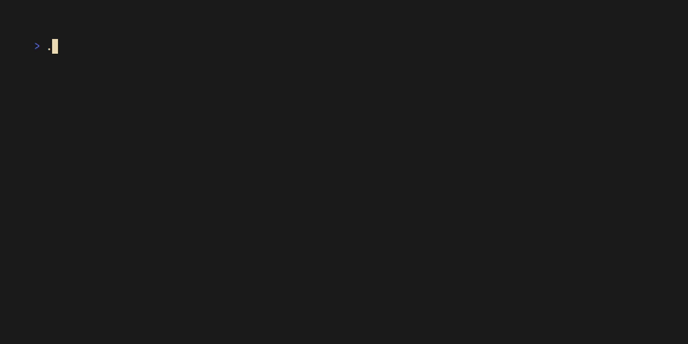

# `cursedngrams`

> (Python 🐍 × NLP 👅) \^ Chaos 😈 = More Chaos ✨ + Python Interpreter
> Tears™ 😱💧

## Usage

    ./cursedngrams.py N [START...] <WORDS.txt

The program reads a sequence of `WORDS` from the standard input, breaks
`WORDS` into `N`-grams, and uses the `N`-grams to continue the sequence
`START` (if given).

Details:

-   `WORDS` are split by any whitespace character.
-   If `N` is less than 2, it is automatically set to 2.

For example:

    ./cursedngrams.py 3 The ship <moby-dick.txt

## Roadmap

-   Make it more cursed.

## See also

-   <https://en.wikipedia.org/wiki/N-gram>
-   <https://massimo-nazaria.github.io/nlp.html>
